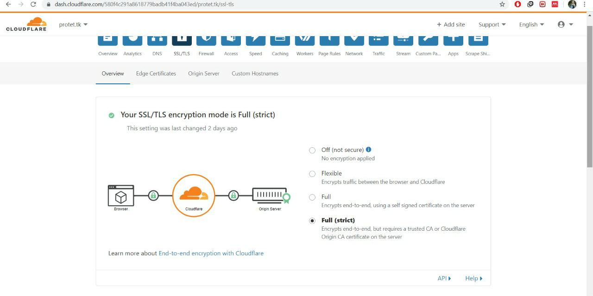
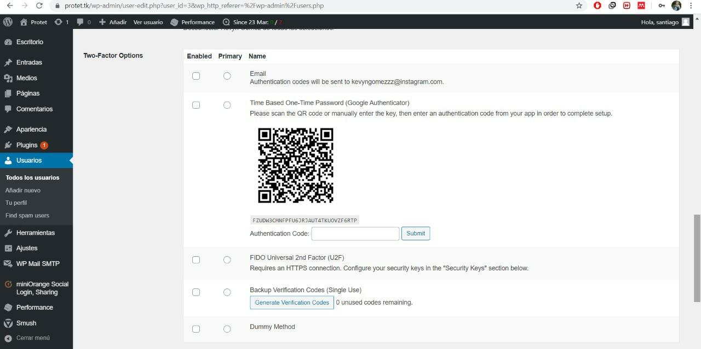
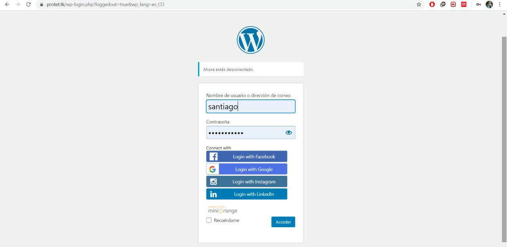
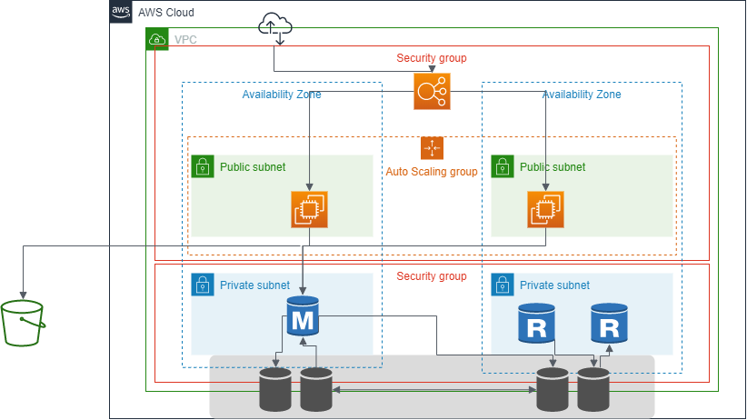
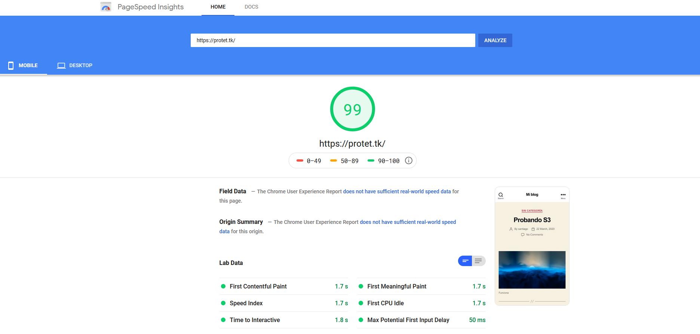
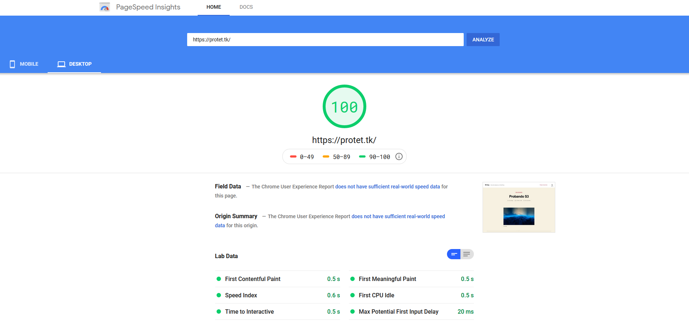
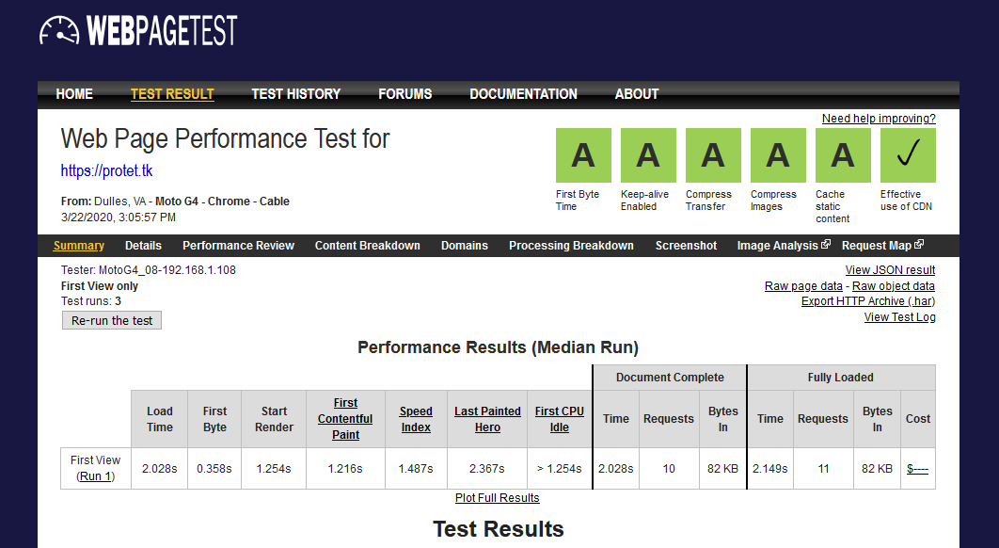
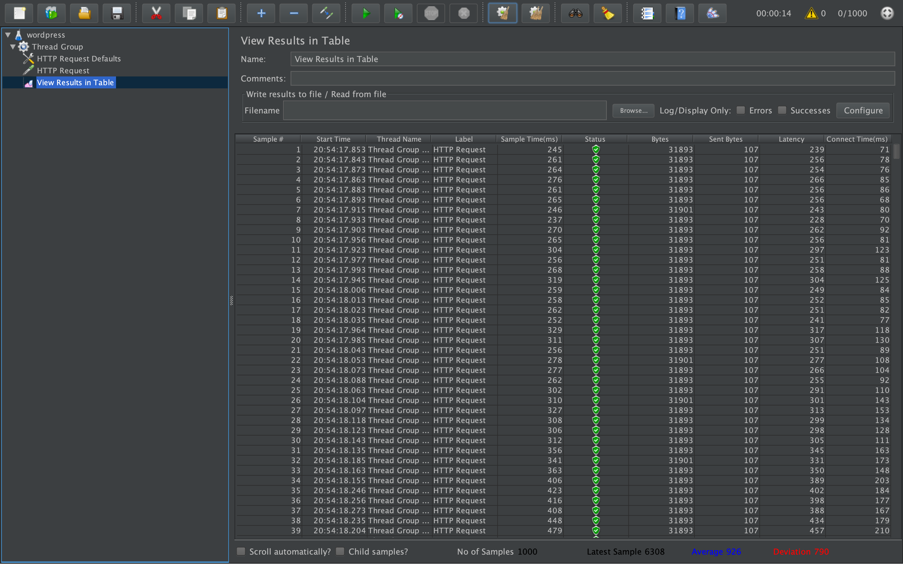

# TET-Proyecto-2

## 1. Datos Generales

### 1.1. Definición de Equipo
  - Santiago Arredondo Quintero | sarredondq@eafit.edu.co 
  - Kevyn Santiago Gómez Patiño | ksgomezp@eafit.edu.co
  - Camilo Gaviria Castrillón | cgavir29@eafit.edu.co

### 1.2. Aplicación Seleccionada
  - WordPress

### 1.3. Dominio e IP en el DCA
  - http://proyecto02.dis.eafit.edu.co | `200.12.180.100`

### 1.4. Dominio Amazon
  - https://protet.tk

### 1.5. Asignación de Roles y Responsabilidades
  * **Santiago Arredondo Quintero**
    * Despliegue WordPress Nativo en Amazon.
    * Diagrama de infraestructura AWS.
    * Diseño e implementación de la estrategia de disponibilidad.
    * Implementación de la arquitectura en AWS.
  * **Kevyn Santiago Gómez Patiño**
    * Obtención dominio y respectiva configuración.
    * Despliegue WordPress Docker en Amazon.
    * Diseño e implementación de la estrategia de seguridad.
  * **Camilo Gaviria Castrillón**
    * Despliegue WordPress Docker en DCA.
    * Despliegue WordPress Nativo en DCA.
    * Diseño e implementación de la estrategia de rendimiento.

### 1.6. GitHub del Proyecto
  * https://github.com/cgavir29/TET-Proyecto-2

## 2. Entendimiento, Contexto y Caso de Uso del Proyecto
El objetivo de este proyecto era implementar una solución a problemas reales con los que se encuentran las compañías cuando ven la necesidad de escalar y asegurar que la experiencia siga intacta. Esto se hace asegurando atributos de calidad como **disponibilidad, seguridad y rendimiento** los cuales fueron desarrollados en Amazon AWS utilizando WordPress como CMS. Es importante destacar también que las tecnologías usadas son las mismas que se implementan en el mundo laboral, es decir, las bases sobre las cuales se establece esta actividad y sus requisitos de cantidad de usuarios, tiempos de respuesta, almacenamiento, entre otros, demandan las tecnologías que representan el estado del arte tanto en aspectos de infraestructura como de desarrollo.

Este proyecto es un sistema LAMP de gestión de contenido diseñado para aproximadamente 20.000 usuarios con un nivel de concurrencia del 10%. Con un diseño de almacenamiento total de 500GB. cada usuario se podrá conectar por una conexión de banda ancha de mínimo 20 Mbps.

Nuestro sitio **https://protet.tk** es una plataforma CMS de WordPress informativa y de prueba académica, donde como estudiantes y administradores del sitio podemos hacer publicaciones las cuales tanto usuarios como suscriptores pueden registrarse y seguir el contenido que está posteado en la web. Podrán acceder por diferentes redes como Facebook, Google, Instagram y LinkedIn, administrar su perfil y navegar en la página.

## 3. Desarrollo de los Requerimientos del Proyecto

### 3.1. Versión Monolítica
  * Se registró en equipo de trabajo en google docs.
  * Inicialmente habíamos pensado en trabajar con Moodle y lo desplegamos en clase usando Docker en el DCA para comprender el funcionamiento del mismo y empezar a familiarizarnos tecnología de contenedores.
  * Cambiamos sistema al CMS Wordpress.
  * Aprendizaje de Docker y herramientas como docker-compose para el despliegue. El siguiente es el fichero de configuración `docker-compose.yml` en que se trabajó durante esta semana y con el cual se desplegó la aplicación posteriormente.
  ```
  version: '3.3'

  services:
     db:
       image: mysql:5.7
       volumes:
	 - db_data:/var/lib/mysql
       restart: always
       environment:
	 MYSQL_ROOT_PASSWORD: somewordpress
	 MYSQL_DATABASE: wordpress
	 MYSQL_USER: wordpress
	 MYSQL_PASSWORD: wordpress

     wordpress:
       depends_on:
	 - db
       image: wordpress:latest
       ports:
	 - "8000:80"
       restart: always
       environment:
	 WORDPRESS_DB_HOST: db:3306
	 WORDPRESS_DB_USER: wordpress
	 WORDPRESS_DB_PASSWORD: wordpress
	 WORDPRESS_DB_NAME: wordpress

  volumes:
      db_data: {}	
  ```
  * Aprendizaje sobre Amazon AWS, principalmente sobre la creación de máquinas virtuales.
  * Se desplegó Wordpress en el DCA usando Docker.
  * Se desplegó Wordpress en el DCA de forma nativa.
  * Obtuvimos el dominio `protet.ml`.
  * Se desplegó Wordpress en Amazon usando Docker.
  * Se hizo la configuración del DNS para Amazon.
  * Se desplegó Wordpress nativo en Amazon.

### 3.2. Versión HPC
  * **Kevyn -> Seguridad:**
    * Adquirimos certificado SSL utlizando **Cloudflare**: 
    * Configuración del SMTP con **WP Mail SMTP**.
    * Two Factor Autentication con el plugin **Two factor** proveído por WordPress: 
    * Autenticación con terceros, Facebook, Google, Instagram y LinkedIn con el plugin **Social Login** preveído por WordPress: 
    * Implementación de protección anti ataques de fuerza bruta con **Anti-Malware Security and Brute-Force Firewall**.
    * Protección anti spam y anti DDoS con **Spam Protection**.  

  * **Santiago -> Disponibilidad:**
    * Se creó un **VPC**.
    * Se creó un **IGW** y se asoció al **VPC** creado.
    * Se crearon 2 **Subnets** públicos y dos privados dentro del **VPC**.
    * Se configuraron los **Subnets** para que auto asignen IP públicas.
    * Se editó la tabla de rutas del **VPC** y se le asocian los los **Subnets** públicos.
    * Se creó los grupos de seguridad de las instancias, balanceador de cargas y la base de datos.
    * Se creó un cluster de **MySQL Aurora** con dos zonas de disponibilidad, backups cada 7 días y manejo de **failover**.
    * Se creó una **instancia** en dos zonas de disponibilidad diferentes con WordPress montado.
    * Se creó un **ELB** configurado para recibir peticiones HTTPS y se le asignan las instancias creadas.
    * Se creó un **Auto Scaling Group** que está asociado al balanceador de carga.
    * Las **instancias**, el **ELB** cuentan con una zona de monitoreo y comportamiento. La **base de datos** y el **Auto Scaling Group** también cuentan con esto y adicionalmente cuentan con una alarmas configuradas en **Amazon CloudWatch**.
    * Diagrama de la arquitectura: 

  * **Camilo -> Rendimiento:**
    * Se montó el CDN utilizando **Cloudflare**.
    * Minificación de HTML, CSS y JavaScript usando **Cloudflare**.
    * Minimización de plugins en WordPress. Sólo se tienen los necesarios para mejorar el desempeño.
    * Estrategia de Caching de _Page Cache, Object Cache y Browser Cache_ utilizando **W3 Total Cache**.
    * Optimización de imágenes existentes y futuras con **Smush** para sean del mismo tamaño que se renderizan.
    * Lazy load en imágenes con **Smush** para que las imágenes no visibles cargen de último, mejorando así el tiempo de respuesta inicial.
    * Creación del bucket en S3 y establecimiento de políticas de acceso al bucket.
    * Creación de políticas de acceso para usuarios IAM hacia S3.
    * Creación de cuenta propia para el contenido estático en S3.
    * Se trasladó el contenido estático satisfactoriamente.
    * Se transladaron los plugins al repositorio para tenerlos disponibles en cada contenedor que se despliegue de manera automática por el autoscaling group.
    * Resultado Google PageSpeed Mobile: 
    * Resultado Google PageSpeed Desktop: 
    * Resultado WebPageTest: 
    * Resultado Jmeter: 

## 4. Dificultades
  * Cuando se desplegaba WordPress de forma nativa en el DCA, el firewall de la máquina no permitía el tráfico al puerto 80 y por ende *Apache* no estaba funcionando como se esperaba. Se utilizó el comando `sudo systemctl stop firewalld` para resolver el problema.
  * Para que WordPress nativo funcionará en el DCA tuvimos que actualizar la versión de *Php* de la `5.4.16` a la `7.3.15`.
  * En AWS se hizo una primera prueba con una instancia y surgieron errores con la versión de PHP ya que no funcionaban varias formas de actualizar la versión. También cuando se instaló MySQL no pedía contraseña root y fue un problema configurarlo ya que traía una por default.
  * AWS Educate no permite trabajar con el servicio de EKS por lo que se tuvo que cambiar de estrategia totalmente.
  * Amazon no permite crear una base de datos de cache REDIS utilizando el servicio ElastiCache.
  * Se había utilizado W3 Total Cache para la minificación de archivos al principio, sin embargo, la método utilizado por ellos daño algunas partes visuales de la aplicación.
  * La creación de usuarios IAM no genera claves de acceso, lo cual no permite establecer una conexión entre WordPress y S3 para la descarga de contenido estático.
  * Si bien se tienen los plugins en cada contenedor que se despliegue, estos no se activan automáticamante en WordPress por lo que tener todas las máquinas al día con la estrategia de rendimiento es inconcebible.
  * Se presentaron problemas en la implementacion del DevOps para nuestra aplicación, por la falta de acceso a la creación de usuarios IAM como otro problema que se mencionó anteriormente.
  * Se presentaron problemas con los subnets ya que estos no asignaban IP pública automaticamente. Se tuvo que configurar.
  * AWS Educate no permitió la creación de un auto scaling group de la base de datos.
